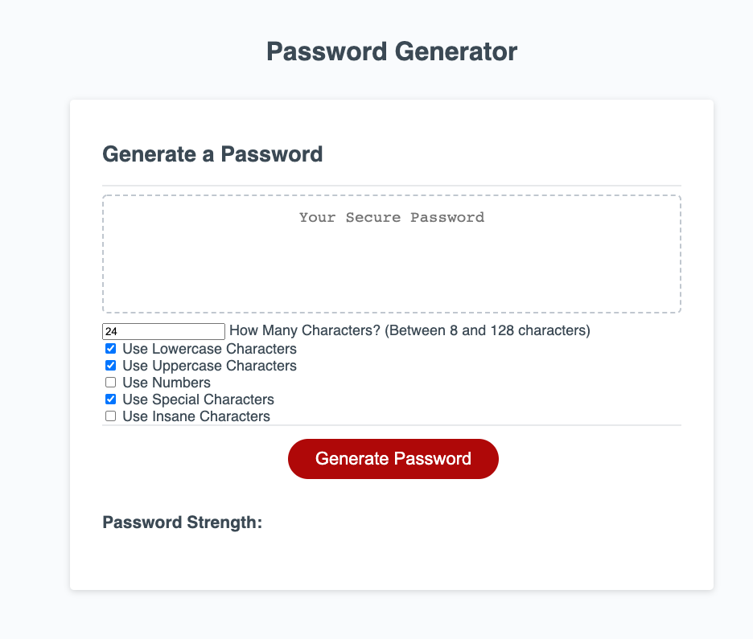

# 03 JavaScript: Password Generator

Here is a password generator which allows a user to set length and complexity of a password. Also a password strength is calculated by both the user choices as well as the random output.  

 [Live Site](https://jordanrbunnell.github.io/randompasswordgenerator/).

## Screenshot

